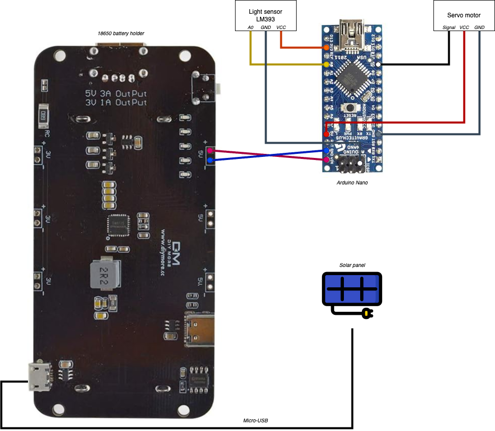

# Automatic door for Omlet Eglu Go, Go Up and Cube

The following project is a proposal for an automatic door for Omlet Eglu chicken coop:
 - https://www.omlet.us/shop/chicken_keeping/modern_chicken_coop_eglu_go/
 - https://www.omlet.us/shop/chicken_keeping/eglu-cube-large-chicken-coop-with-runs/

 These chicken coops come with a rotative door that does not allow the use of a classic automatic door.

 This project offers an easy way to solve this lack at a low price and almost no specific skill.

 ## Bill of materials

 - 1x Arduino Nano: https://www.aliexpress.com/item/1005006128051481.html (Pick one with soldered pins)
 - 1x Waterproof 20Kg servo: https://www.aliexpress.com/i/4000601609839.html
 - 1x 25T whole arm: https://www.aliexpress.com/item/1005004764664030.html
 - 1x Light sensor: https://www.aliexpress.com/item/1005002327161114.html
 - 8x Dupont wires: https://www.aliexpress.com/item/1005005959798732.html (I recommend a mix of 10cm wires)
 - 2x 18650: https://www.aliexpress.com/item/1005006098729827.html
 - 1x 18650 shield: https://www.aliexpress.com/item/1005005578443185.html
 - 1x 110x80x45 Waterproof junction box: https://www.aliexpress.com/item/1005005473570434.html
 - 2x Waterproof power glant (PG7): https://www.aliexpress.com/item/4000242432947.html
 - 22x Threaded M3x5.7x4.6 inserts: https://www.aliexpress.com/item/1005006076276418.html
 - 24x M3x12 hex screws: https://www.aliexpress.com/item/1005006034879477.html
 - (Optional) 1x Solar panel 5V 3W: express.com/item/1005005372734551.html

 ## 3D models to print

You must print the following models. Use 25% infill and 6 wall loops to get enough strength.

 - 1x base
 - 2x knob
 - 1x knob-cover
 - 1x knob-locker
 - 2x motor-support
 - 1x motor-socket
 - 1x base-cover

 Once printed, you should add the threaded inserts into each model.
 Do not assemble the whole system yet as it need to be directly screwed on the chicken coop.

 ## Cable the Arduino Nano

 Follow the following scheme to wire the servo, the sensor and the battery to the Nano.

 ## Upload the program to the Arduino Nano

  - Download Arduino IDE on your computer and declare a new board "Arduino Nano". You may need to switch to old bootloader into Tools -> Processor.
  - Add "Low-Power" library (watch out there is another one with a close name).
  - Copy the ino file of this project into your IDE.
  - Connect the Nano to your computer.
  - Press the Upload button and wait a few seconds.

You can simulate the code at the following link: https://wokwi.com/projects/381990476490086401

The Nano, the battery pack and the light sensor can be placed into the waterproof junction box. Don't forget to let the sensor "see" directly through the window.
You should use power glants to let the wires go outside.

## Put it all together

 - Add the base on the Eglu
 - Add the two pieces of the knob around the opening system (may be a bit hard to slide it in place)
 - Screw the motor supports on the base (4 screws)
 - Screw the knob cover on the servo arm and then the arm to the servo (2 screws)
 - Install the motor into its socket from the bottom (no need to screw it but you can if you want to)
 - Screw the socket to the supports (4 screws)
 - Start the arduino so the servo will move to the OPEN position
 - Screw the knob cover to the knob (4 screws)
 - Install the base cover (should be tighten without any screw)
 - Screw the junction box with the nano on the base cover (2 screws)

## Enjoy !
